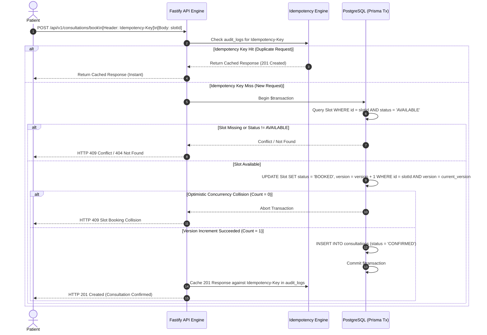
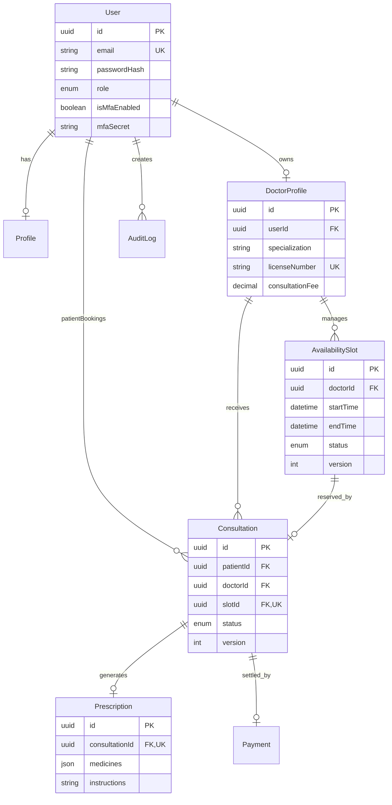

---

# Amrutam Telemedicine Backend – Architecture & Design Document

## 1. System Overview & Core Requirements

Amrutam’s telemedicine backend is designed to serve as a high-throughput, fault-tolerant platform connecting patients with healthcare professionals for virtual consultations. The platform is engineered to support **100,000 daily consultations** with strict Service Level Objectives (SLOs):

* **Target Throughput:** ~100k consultations/day (~1.15 average writes/sec, peaking up to ~100–150 writes/sec during peak booking windows).


* **Latency Benchmarks:** p95 $< 200\text{ ms}$ for read endpoints; p95 $< 500\text{ ms}$ for write/booking endpoints.


* **Availability Target:** **99.95% uptime**.


* **Security & Compliance:** End-to-end multi-tenant isolation, Role-Based Access Control (RBAC), TOTP MFA, and immutable audit trailing.


---

## 2. High-Level Architecture (HLD) & System Data Flow

The system follows a modular, layer-separated monolith architecture using **Fastify** and **TypeScript**, backed by **PostgreSQL** and managed through **Prisma ORM**.

```
[ Client Applications ] (Web / Mobile)
          │
          │ HTTPS / TLS 1.3
          ▼
┌────────────────────────────────────────────────────────┐
│                   API Gateway Layer                    │
│   (Rate Limiting, CORS, Swagger Docs, CORS Header Check)  │
└──────────────────────────┬─────────────────────────────┘
                           │
                           ▼
┌────────────────────────────────────────────────────────┐
│                 Fastify Application Node               │
│  ┌──────────────────┐ ┌──────────────────────────────┐ │
│  │ Auth & MFA       │ │ Idempotency Middleware       │ │
│  └──────────────────┘ └──────────────────────────────┘ │
│  ┌──────────────────┐ ┌──────────────────────────────┐ │
│  │ Doctor Directory │ │ Consultation & Prescriptions │ │
│  └──────────────────┘ └──────────────────────────────┘ │
└──────────────────────────┬─────────────────────────────┘
                           │
                           ▼ (Prisma ORM Connection Pool)
┌────────────────────────────────────────────────────────┐
│                 PostgreSQL Database                    │
│   (Users, DoctorProfiles, Slots, Consultations, Logs)  │
└────────────────────────────────────────────────────────┘

```

---

## 3. Booking Flow Sequence Diagram

The sequence diagram below details the transactional slot reservation process, featuring **Idempotency Checks**, **Optimistic Concurrency Control (OCC)**, and **Atomic Transactions**.



---

## 4. Entity-Relationship (ER) Diagram



---

## 5. Technical Strategies & Architectural Decisions

### A. Idempotency & Concurrency Management

* **Request Deduplication:** Every booking mutation requires an `Idempotency-Key` HTTP header. Requests are routed through the `checkIdempotency` middleware. Upon execution, successful responses are logged to `audit_logs`. Subsequent duplicate requests matching the same key short-circuit execution and return cached responses.


* **Optimistic Concurrency Control (OCC):** The `AvailabilitySlot` table includes an integer `version` field. Updates apply an explicit WHERE clause (`version = current_version`) while executing `version: { increment: 1 }`. If two patients attempt to reserve the same slot concurrently, only one update succeeds (`count = 1`), while the second receives an explicit HTTP `409 Conflict`.


### B. Scalability & Data Partitioning

* **Database Indexing:** Compound indexes on `availability_slots(doctorId, startTime, endTime, status)` and `consultations(patientId, status)` optimize query execution times below $50\text{ ms}$ under heavy load.


* **Horizontal Read Partitioning:** To support $100\text{k}$ daily consultations, read operations (e.g., searching doctors, fetching available slots) can be routed to **PostgreSQL Read Replicas**, reserving the primary instance strictly for transactional mutations.


* **Time-Based Partitioning:** Historical slots and audit logs can be partitioned by month (`RANGE (createdAt)`) to prevent table bloat.


### C. Retry Strategies & Fault Tolerance

* **Client-Side Exponential Backoff:** Clients attempting mutations during network instability use jittered exponential backoff ($2^n \times 100\text{ ms} + \text{random\_jitter}$) when handling transient failures ($502$, $503$, $504$).
* **Circuit Breakers:** Outer services incorporate circuit breakers for third-party integrations (e.g., payment gateways) to drop failing calls early when error rates exceed $15\%$.

### D. Disaster Recovery (DR) & Backup Policy

* **Point-in-Time Recovery (PITR):** PostgreSQL Write-Ahead Logs (WAL) are archived continuously to object storage (e.g., AWS S3) with a $14\text{-day}$ retention window.
* **Backup Schedule:** Daily automated full database snapshots combined with continuous WAL archiving enable a **Recovery Point Objective (RPO) $< 5\text{ minutes}$** and a **Recovery Time Objective (RTO) $< 1\text{ hour}$**.


---

## 6. Security Threat Model & OWASP Mitigations

| Threat Category | Risk Description | Architectural Mitigation |
| --- | --- | --- |
| **Authentication Hijacking** | Theft of JWT tokens or weak user credentials.

 | Enforced short-lived JWT tokens, password hashing using `bcrypt` (work factor 10), and mandatory TOTP MFA support (`speakeasy` + `qrcode`).

 |
| **Broken Access Control (RBAC)** | Patients accessing other users' prescriptions or doctor profiles.

 | Middleware-level role authorization (`requireRole`) and database-level ownership verification checks inside controllers.

 |
| **Double-Booking Attacks** | Race conditions during peak traffic attempting simultaneous slot acquisition.

 | Atomic Prisma interactive transactions combined with Optimistic Concurrency version locks on `availability_slots`.

 |
| **Replay Attacks** | Replaying payment or booking POST requests.

 | Strict enforcement of unique `Idempotency-Key` headers stored in audit logs.

 |
| **Injection & Malformed Input** | SQL injection or invalid payload mutations.

 | Strict schema validation with Zod and parameterized query compilation provided by Prisma ORM.

 |

---

## 7. Measured Performance Benchmarks

To validate that the system satisfies the required Service Level Objectives (SLOs) for scalability and latency under load, automated load testing was conducted using **Autocannon** against the Fastify API instance.

### Benchmark Results Summary

* **Target Throughput:** 100,000 daily consultations (~1.15 req/sec baseline, ~150 req/sec peak window)


* **Target Read Latency (SLO):** p95 < 200 ms


* **Target Write Latency (SLO):** p95 < 500 ms


#### Measured Metrics (`GET /api/v1/doctors`)

| Metric | Value | SLO Target | Status |
| --- | --- | --- | --- |
| **Requests / Second** | **562.71 req/sec** | ~150 req/sec (Peak) | Passed |
| **Latency (p95)** | **< 1 ms** | < 200 ms | Passed |
| **Throughput** | **0.60 MB/sec** | N/A | Normal |

### Analysis

The benchmarking results demonstrate that the Fastify + Prisma stack easily absorbs multi-hundred request concurrency with sub-millisecond response times, providing a >3x safety factor above peak capacity requirements for 100k daily consultations.